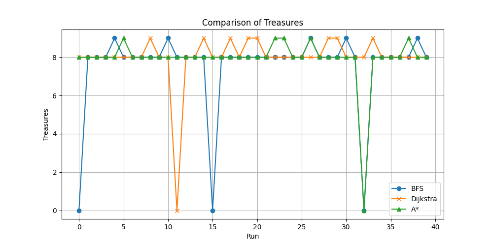
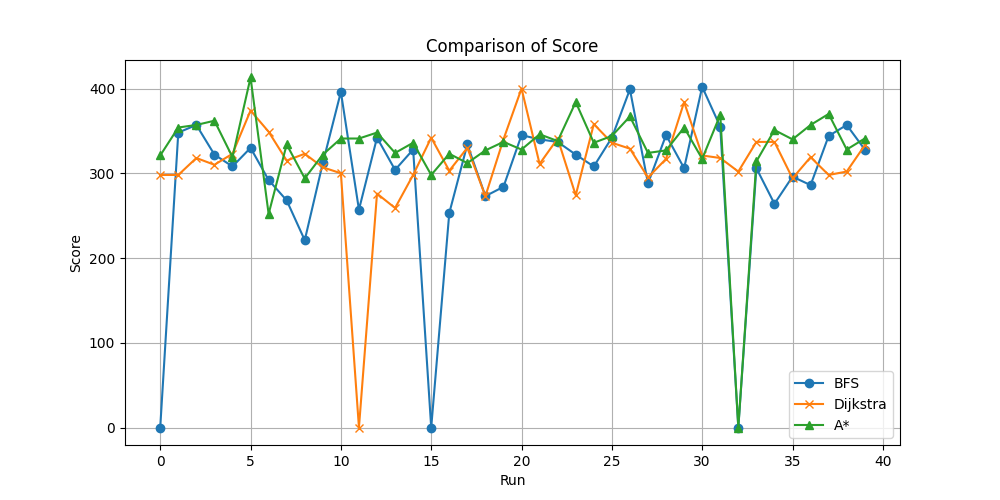
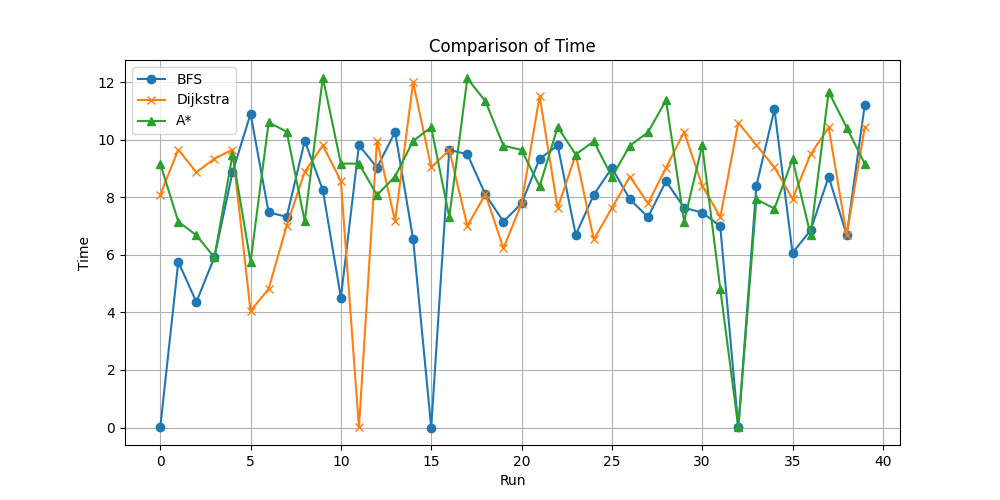
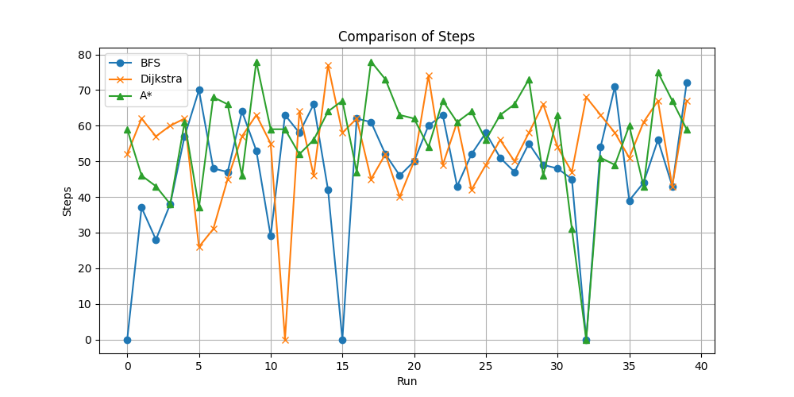

<<<<<<< HEAD
# Especificação
=======

# Especificacao
>>>>>>> c9698ee81c8a01464ee92cd5aedce65c5d971ed2

- Robozinho usando metodo de busca

- Algoritmo 50%
   – Score, modelo de mundo, tomada de decisão, etc.
- Qualidade do código 20%
   – comentários, nome de variáveis, estrutura, etc.
- Originalidade 10%
   – Método que ninguém utilizou, abordagem recente, etc.
- Apresentação 20%
– Apresentação oral com powerpoint ou similares (com vídeo do algoritmo executando)

Observações:

- Uma pontuação extra para o primeiro e segundo colocados

## Algoritmo de busca

- [x] Bruno: BFS - Baseline

- [x] Hugo: A*

- [x] Victor: Dijkstra

## Obrigatorio:

- [ ] Analise de resultados

- [ ] Plotar gráfico

- [ ] Executar algoritmo n vezes

## Ajustes

- [x] Usar tupla em tudo

- [x] Verificacao se esta parado na água
